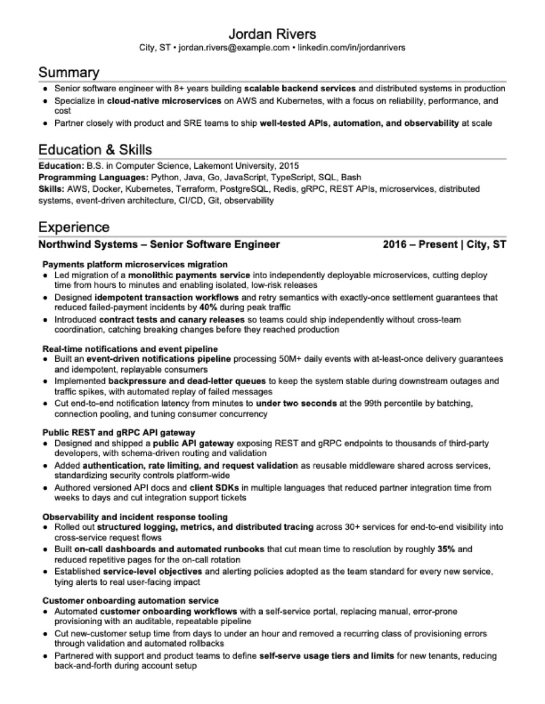
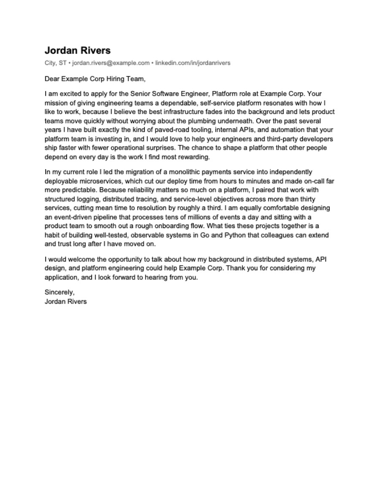

# Jobs Finder — AI job hunting without invented experience

AI should tailor your resume—not invent your career or force it into someone
else's template. Jobs Finder starts from experience and skill rules you approve,
preserves your own Word format, and rejects output that changes locked facts or
breaks the one-page layout.

Point Claude Code, Cursor, Codex, or another AI coding agent at this repo to find
matching roles, create validated resumes and a researched cover letter for every
posting, track your application pipeline, and prepare for interviews—all in a
local, reproducible workflow you can inspect and control.

## What makes it different

Many tools can write a resume, score it against a JD, or track applications. This
toolkit treats the whole job hunt as a **local, reproducible build** with safeguards
that the surveyed commercial and open-source alternatives do not publicly document
together:

| Differentiator                         | What it means in practice                                                                                                                                                                                                                                                                    |
| -------------------------------------- | -------------------------------------------------------------------------------------------------------------------------------------------------------------------------------------------------------------------------------------------------------------------------------------------- |
| **Truthfulness is a build gate**       | Tailoring starts from your approved baseline resume. Locked identity/employment fields and real project titles are machine-checked. Skills follow explicit consequences: Never means never include, Weak or Selective means include only when the JD specifically mentions it, and Approved means include in most resumes, if not all. Unknown skills fail validation instead of being silently added. |
| **Your DOCX is the template**          | The renderer fills your own approved Word document, preserving its fonts, margins, spacing, and styles, then rejects a PDF that is not one page, is broken, or leaves too much blank space.                                                                                                  |
| **Every application is reproducible**  | The saved JD, structured resume source, exact DOCX/PDF, metadata, and copy-paste answers stay together. Related roles can share one honest resume, but every JD still gets its own researched letter and packet.                                                                             |
| **One workspace covers the full hunt** | Multi-source, sponsorship/location-aware discovery feeds tailoring, a folder-backed application pipeline, deep company/role research, and reusable behavioral interview stories.                                                                                                             |
| **Privacy is architectural**           | Real data can live in a separate private overlay. A blocking leak guard checks paths, text, structural PII, identity tokens, and extractable DOCX/PDF content before the public toolkit can ship.                                                                                            |

See the [feature inventory, competitor matrix, implementation deep dives, limitations,
and sources](docs/handbook/comparisons/resume-writing-tools.md). The comparison was researched
on 2026-07-20; “not publicly documented” is evidence of differentiation, not a claim
that another product could never implement the capability.

Here is what one tailoring run produces — a resume rendered into *your* approved
DOCX format, plus an individually researched cover letter per posting:

| Tailored resume (PDF) | Cover letter (PDF, one per posting) |
|---|---|
|  |  |

Every application also gets a bundled, copy-paste `..._Application_<role>.txt`
(cover letter + "why this company/role" + "past experience" sections for portal
text boxes) and a `meta.yaml` of structured facts (level, required YOE, salary,
sponsorship). The full worked example lives in
[`examples/me/applications/6_drafted/example-corp-senior-software-engineer/`](examples/me/applications/6_drafted/example-corp-senior-software-engineer/).
For contributors and integrators, the
[`examples/fixtures/resume-writer/`](examples/fixtures/resume-writer/) corpus adds
fully synthetic multi-employer, promotion, internship, contractor, hybrid-project,
malformed, and unsupported-layout inputs with expected outputs.

## Try it in three commands

Works out of the box on a fresh clone — no config needed; every tool falls back to
the fictional "Jordan Rivers" example candidate. Requires Python 3.11+ and, for PDF
output, LibreOffice (`brew install --cask
libreoffice` on macOS; `sudo apt install libreoffice` inside Ubuntu/WSL). Windows users
must run the toolkit through WSL2 and should start with the
[`windows-environment` skill](skills/windows-environment/SKILL.md). Without a converter the render stops and says the
one-page check could not run; add `--no-pdf` if you deliberately want a DOCX-only draft.

```bash
# Paste this repo's own URL — the green "Code" button above, or your fork's.
git clone "https://github.com/<owner>/jobs-finder-toolkit.git" && cd jobs-finder-toolkit
python3 automation/check_python.py && python3 -m venv .venv && .venv/bin/pip install -r requirements.txt
.venv/bin/python skills/resume-writer/scripts/render.py examples/me/applications/6_drafted/example-corp-senior-software-engineer/
```

**Keep the quotes around the clone URL.** Unquoted, `zsh` (the macOS default
shell) reads `<owner>` as an input redirection and the line dies with
`no such file or directory: owner` before `git` ever starts — an error that
names a file you never mentioned. Quoted, a URL you forgot to fill in fails as
what it is: a bad URL.

The first half of the next line is a real gate, not a formality. Bare `python3`
still resolves to a 3.7-era interpreter on plenty of macOS boxes, and
`python3 -m venv` on one of those **exits 0** and quietly installs an obsolete
pip — so the only symptom arrives minutes later as a misleading
`No matching distribution found for python-jobspy`. `check_python.py` stops
before the venv exists and names a newer interpreter it found on your PATH; the
recovery is to create the venv with that one —
`python3.13 -m venv .venv` (or `uv venv --python 3.13`) — and re-run the pip
install.

That renders and validates the example resume + cover letter you see above. Then
open the repo in your AI agent and just talk to it — the skills route themselves.

### Your first search

This one needs **network access** — it queries public company job boards and
keyless aggregators live. Nothing else in the quickstart goes online.

```bash
.venv/bin/python skills/job-search/scripts/search_jobs.py --profile example
```

`example` is the tracked, personal-detail-free profile at
[`skills/job-search/profiles/example.yaml`](skills/job-search/profiles/example.yaml),
so this runs on a fresh clone with no config and no private overlay. The ranked
shortlist is written to `examples/market/scans/current/<YYYYMMDD>-example.md`
(git-ignored) and a compact summary prints to your terminal.

Three knobs in that profile are worth editing before you trust the results:

| Knob | What it does |
|---|---|
| `titles.include` | The title gate — a posting is only a candidate if its title contains one of these terms. Widen or narrow it first; everything downstream is filtered by it. |
| `location.*` | `preferred` boosts metros, `allow_remote`/`us_only` bound the geography, and `require_match: true` turns the boost into a hard filter. |
| `max_age_days` | Recency window (`null` = no age filter). Set it to `7` for "posted this week". |

Copy the file before you tune it — see
[`skills/job-search/profiles/README.md`](skills/job-search/profiles/README.md)
for the full field reference and how to run a profile of your own.

## The workflow

The toolkit turns one **candidate profile** into tailored applications and tracks
them. One-time setup, then five steps, each driven by a prompt to your agent:

```
0. Setup ............ config.yaml + profile + baseline resume YAML + reference DOCX   (one time)
1. Profile & filters  define WHO you are and WHAT you want    → job-search profile
2. Search ........... find fresh, sponsorship-aware postings  → job-search skill
3. Generate ......... tailor resume + cover letters per JD    → resume-writer skill
4. Review & track ... you decide; move the folder             → application-tracker
5. Interview prep ... company research + behavioral stories   → company-research /
                                                                behavioral-interview-prep
```

> "Find senior backend roles posted this week that sponsor H-1B"
> "Tailor my resume for this job: [paste JD]"
> "Research Example Corp for my interview and build a question bank"

Applications land in `6_drafted/` for your review; **the folder is the status** —
move it to `5_applied/`, `4_in_progress/`, `3_rejected/`, or `2_ignored/` as things
progress (or ask the agent; the number prefix is a fixed sort key, not a sequence). `status.py` prints the pipeline any time:

```bash
.venv/bin/python skills/application-tracker/scripts/status.py
```

New here? Ask your agent anything — the `ask-me-anything` skill is the built-in
tour guide for the whole toolkit.

## Use your own data

Your real identity never enters this repo. Copy the example config and point its
`paths.*` at your own files — `config.yaml` is git-ignored:

```bash
cp config.example.yaml config.yaml     # edit: your name, your file paths
.venv/bin/python automation/bootstrap_overlay.py    # wires `git ws`, git hooks, and mounted private skills
```

Keep your real profile, applications, and interview prep in a **private overlay** —
your own git repo mounted at the git-ignored `private/` directory. A leak guard
screens every tracked file for your identity so nothing personal can ship by
accident — it runs blocking in CI, over every exact Git tree being pushed, and
over the staged index on every commit. Full walkthrough, including
creating an overlay from scratch: [docs/handbook/private-overlay.md](docs/handbook/private-overlay.md).

## The skills

Skills live in [`skills/`](skills/) — self-contained (each bundles
its scripts and vendored dependencies), agent-agnostic, and also published as a
Claude Code plugin marketplace via
[`.claude-plugin/marketplace.json`](.claude-plugin/marketplace.json):

- `ask-me-anything` — orientation guide: the five-step workflow and what each step needs (start here)
- `job-search` — discover and rank fresh postings by role, location, recency, and visa sponsorship
- `resume-writer` — tailor single- or multi-employer resumes for ATS fit and render validated DOCX + PDF + cover letters
- `application-tracker` — pipeline status, structured `meta.yaml` facts, notes, skip-logs
- `behavioral-interview-prep` — project-based STAR story banks and reusable answers
- `company-research` — deep company + role research and an interview question bank
- `email-assistant` — read personal Outlook mail and create job-context reply drafts; never sends
- `interview-calendar` — reconcile interview email, application progress, and duplicate-free Outlook events
- `gardener` — periodic memory hygiene for the toolkit's agent-memory zones (dry-run by default)
- `search-recall-audit` — spot-check whether job-search silently missed or over-kept matching roles
- `github-workflow` — write the PR description, stack PRs, clear the push gates, drive CI and merges
- `windows-environment` — install, diagnose, and validate the Windows/WSL2 development environment

## Repo layout

```
config.example.yaml      # tracked "Jordan Rivers" placeholder (+ no-config fallback)
examples/                # fictional candidate (me/, market/) + app + resume/JD fixtures
skills/<skill>/          # the skills: SKILL.md + self-contained scripts
automation/              # everything that runs: shared modules, vendoring, gardener,
                         #   pipeline audits, metrics, leak guard, git hooks, the reconciler
templates/               # single source of truth for process-file schemas
evals/                   # measurement: canary sets per skill, A/B + stage protocols, rubrics, runs
docs/handbook/           # extended reference: architecture, private overlay, metrics
docs/designs/            # active design programs (one folder per topic)
docs/roadmap/            # desired vs current state — the gap is the backlog's source
message-queue/ tasks/    # async human<->agent messages / work items (status = folder)
memory/ history/         # ADRs+facts+lessons / session handovers
AGENTS.md                # the agent-facing contract (guardrails + conventions)
```

## Learn more

- [docs/handbook/architecture.md](docs/handbook/architecture.md) — how it works: the render pipeline,
  config system, application-folder model, vendoring, CI gates, and the full repo
  reference table
- [docs/handbook/private-overlay.md](docs/handbook/private-overlay.md) — the public/private two-repo
  model and overlay setup
- [docs/handbook/comparisons/resume-writing-tools.md](docs/handbook/comparisons/resume-writing-tools.md)
  — detailed feature inventory, market comparison, implementation deep dives, and
  official sources
- [AGENTS.md](AGENTS.md) — the contract AI agents follow (no fabrication,
  validation is mandatory, folder conventions)
- [CONTRIBUTING.md](CONTRIBUTING.md) — dev setup, the check suite, and the PR
  workflow ([CI](.github/workflows/ci.yml) runs it all, including a blocking
  privacy leak guard)

**License:** Apache-2.0. The example candidate ("Jordan Rivers") and all
`examples/` data are fictional.
