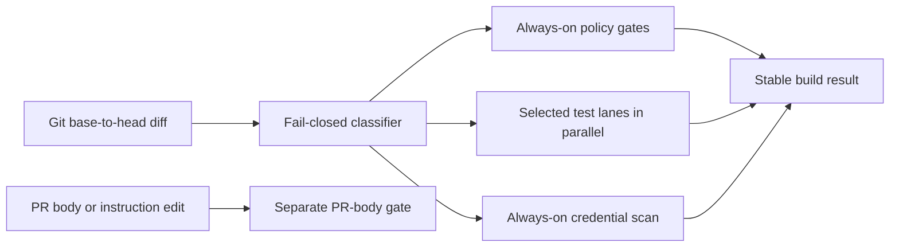

# Fast, risk-scoped pull-request verification

**Status:** In review. PR #266 exercised the fail-closed full matrix successfully; PR #270 carries the stack-driver fast path, retarget guard, focused workflow guidance, and canary evidence.

This design shortens routine pull-request verification by always running the repository's high-consequence policy checks, while running long render and unit-test lanes only when the changed inputs can affect them. Any classification uncertainty expands to the full suite, and every `main` or manually dispatched run executes the full matrix.

## What is slow today

The current workflow serializes dependency installation, LibreOffice installation, every test family, rendering, and exporter checks in one `build` job. That makes a documentation-only pull request pay for every product domain.

Representative hosted-runner evidence:

| Measurement | Observed result |
|---|---:|
| Last 60 successful pull-request runs, median wall time | 184 seconds |
| Last 60 successful pull-request runs, p90 wall time | 207 seconds |
| Representative dependency install | 18 seconds |
| Representative LibreOffice install | 31 seconds |
| Representative serial test tail | 127 seconds |
| Native stack #224, nine entries merged atomically | about 6 seconds |
| Older stack #133, eleven entries merged one at a time | about 8 minutes 19 seconds |

The pull-request distribution was measured from GitHub Actions run metadata on 2026-08-03. The step values come from run `30799648925`; they are stage measurements tied to that run, not timeless constants.

## Verification architecture

The change classifier is a small standard-library program that maps the base-to-head Git diff to long-running test lanes. Policy and credential checks remain unconditional, while a stable final `build` result waits for every selected result and fails on any failure or cancellation.



Same picture, plain text:

```text
┌──────────────────┐    ┌────────────────────┐    ┌─────────────────────┐
│ Base-to-head diff│───▶│ Fail-closed selector│───▶│ Always-on policy    │──┐
└──────────────────┘    └─────────┬──────────┘    └─────────────────────┘  │
                                  ├───────────────▶│ Parallel test lanes │──┼─▶ build
                                  └───────────────▶│ Credential scan     │──┘

┌──────────────────┐    ┌────────────────────┐
│ PR body/edit event│───▶│ Separate body gate │
└──────────────────┘    └────────────────────┘
```

Takeaway: every pull request keeps the irreversible-safety checks, while its wait is determined by the slowest relevant test lane instead of the sum of every lane.

### Always-on policy

These checks stay blocking on every pull request because they are fast, protect cross-cutting repository contracts, or prevent an irreversible outcome:

- vendored-copy consistency;
- the mail send-less policy;
- Python byte-compilation;
- process-schema reconciliation;
- reference and Markdown-link validation;
- instruction-file budgets;
- review-ledger admission and integrity;
- the whole-tree public-data leak guard;
- credential-shape scanning over the pull request's history.

The pull-request-body gate becomes its own workflow. Editing a description then reruns only that gate instead of reinstalling LibreOffice and rerunning every product test against an unchanged commit.

### Long-running lanes

The classifier selects from seven owned lanes. A change can select more than one.

| Lane | What it verifies | Typical owners |
|---|---|---|
| `maintenance` | Reconciler, gardener, hook, metrics, eval-pin, gate-runner, and GitHub-workflow tests | The corresponding `automation/` folders and GitHub-workflow scripts |
| `render` | The fictional example resume and PDF render | Render code, resume templates, and example application inputs |
| `resume` | Resume-writer unit and end-to-end tests | `skills/resume-writer/scripts/` |
| `shared` | Shared/store tests and example-store validation | Store tooling and example-store inputs |
| `job-search` | Recall-audit and job-search tests plus the filter-variant corpus | Job-search and search-recall-audit runtime code |
| `applications` | Tracker, email, behavioral-prep, and calendar tests | Those skills' runtime scripts |
| `publish` | Exporter, review-gate, manifest, and leak-guard tests | `automation/publish/` |

Independent non-PDF lanes run in isolated GitHub jobs. Render and resume lanes share one PDF job because both require LibreOffice: the job installs it once, then runs whichever of the two lanes were selected. This removes a duplicate package transaction and bounds the remaining install at 180 seconds. The other isolation removes shared-worktree conflicts that currently force several local gates to run serially.

### Fail-closed selection

Known process records and general documentation can select policy-only verification. The following shapes always select every long lane:

- an unknown or unowned path;
- a non-record deletion, rename, type change, or unmerged Git status;
- workflow, classifier, gate-routing, dependency, or configuration changes;
- canonical shared-foundation or vendoring changes;
- a missing or unreadable Git range;
- any explicit full run on `main` or through `workflow_dispatch`.

Templates are executable process schemas, not inert prose; they receive maintenance coverage or the full fallback. Skill instruction files still require the existing canary/eval discharge in the pull-request body even when no script test lane owns their prose.

## Workflow and stack behavior

Normal pull requests run policy, credential scanning, and selected lanes. `main` and manually dispatched workflows run every lane. A concurrency key per pull request or branch cancels a superseded run so an obsolete commit does not keep consuming runners after a newer commit exists.

The final job retains the existing `build` name. It uses `if: always()` and accepts a skipped matrix only when the classifier deliberately selected no long lane; classifier, policy, credential, or selected-lane failures and cancellations make `build` fail.

For a fully reviewed native GitHub stack, one explicit atomic merge of the highest approved contiguous entry is the fast path. The merge driver must inspect every entry that will be swept in, pin their heads, reject drafts or red checks, poll the asynchronous merge result, and independently confirm the merge. Sequential bottom-up merging remains the path when intermediate trunk states must land separately.

For ordinary chained pull requests, retargeting remains explicit after the parent merges. A child already targeting the intended base is a no-op: the driver reports it and does not call `gh pr edit`, avoiding an `edited` event and duplicate CI on the same head.

A real base retarget still emits `edited`, but the required PR-body job distinguishes it from a description edit. Base-only edits skip that job; description edits continue to run it. This prevents an ordinary bottom-up stack from creating a new required-body wait between entries.

## Test-framework direction

Changing from `unittest` to another framework is not the first optimization: hosted measurements show dependency setup and real test work dominate discovery. The order is:

1. select only affected suites;
2. run independent suites in isolated jobs;
3. record per-file timing for any lane still over 60 seconds;
4. shard slow files or test methods with isolated temporary roots;
5. replace repeated full exports, Git subprocesses, or CLI subprocesses with shared immutable fixtures and a small retained end-to-end set where the evidence supports it.

The reusable idea from `~/code/ai-harness/automation/run_tests.py` is explicit input ownership with an unknown-input full fallback. This repository borrows that contract, not its repository-specific mapping.

## Rollout and acceptance

The first workflow-changing pull request necessarily selects the full matrix because workflow and selector changes are foundational. A stacked follow-up then exercises a focused lane against the new workflow. Every `main` run supplies the full-suite backstop while selective behavior gains evidence.

First rollout observation, PR #266: hosted run `30805311849` completed the
full green matrix in 88 seconds from creation through final `build`, compared
with the 184-second historical PR median. Policy took 28 seconds and the slowest
lane took 70 seconds. Updating the PR body afterward started only the dedicated
`PR body` workflow (`30805537781`, green) and created no second CI run.

Second rollout observation, PR #270: hosted run `30806602419` completed its
deliberately full matrix in 109 seconds. Policy took 27 seconds, the slowest lane
took 61 seconds, and every selected lane passed. The separate body run
`30806612926` passed in 14 seconds wall time with an 8-second job. Both
workflow-changing observations remain below the 150-second full-matrix target.

The first documentation-only probe on stacked PR #275 exposed a base-selection
bug before rollout: run `30807216699` compared the tip with `origin/main`, saw
the lower workflow commit, and unnecessarily selected all seven lanes. The
workflow now compares the immutable pull-request base and head SHAs, then uses
their merge base. A static regression test rejects a return to the hardcoded
default branch. The fix itself must run the full matrix; a clean documentation
tip above it is the acceptance probe for policy-only timing.

The correction run then exposed a separate full-matrix tail: one of two parallel
LibreOffice installations remained inside `apt-get install` for more than five
minutes while its duplicate in the resume lane completed. The workflow now
groups render and resume behind one bounded installation. This keeps both hard
PDF gates while halving the number of external package transactions on full runs.

Acceptance targets:

| Scenario | Target |
|---|---:|
| Policy-only pull request | p50 at or below 45 seconds; p95 at or below 90 seconds |
| One targeted lane | p95 at or below 120 seconds |
| Full parallel matrix | p95 at or below 150 seconds |
| Full builds caused only by body edits or no-op retargets | zero |
| Superseded active runs per pull request or `main` | at most one |
| Ready five-to-ten-entry native stack, final green check to confirmed atomic merge | at or below 60 seconds |
| Classifier uncertainty cases | every tested case selects all lanes |

After the new `build` and `pr-body` contexts have both reported successfully, the repository ruleset should require both. At the baseline it prevents branch deletion and non-fast-forward updates but requires no status check, so CI is a convention rather than a merge guard.

## Human questions / additional tasks

<!-- Add questions or follow-up requests below. Agents append answers; they never overwrite owner text. -->
