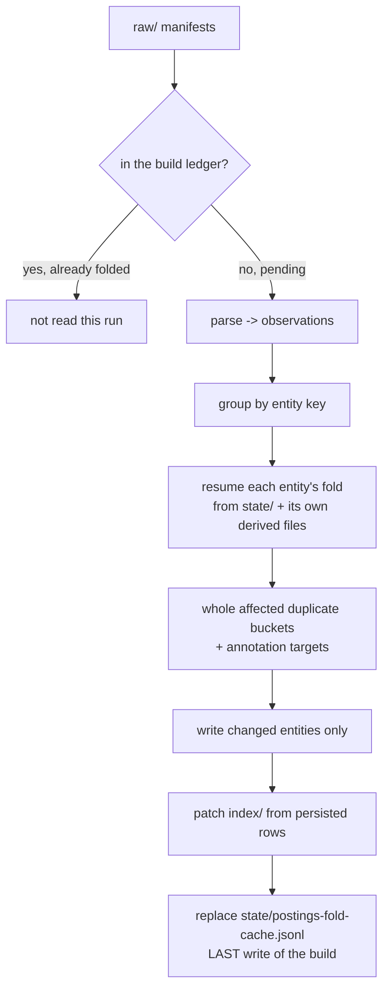

# 05 — Incremental builds that cost O(new), not O(store)

**Status:** implemented. This document records the design that made a routine
post-fetch build fold only the manifests it has not seen, the proof that doing
so still produces byte-identical output, and the two measured choices the work
required (how the index zone is updated, and whether to take the sanctioned
SQLite escape hatch).

The store builder is `skills/job-search/scripts/build_postings.py`; the state
it now persists lives in `skills/job-search/scripts/postings_fold_state.py`.

## The problem this solves

The [job-postings pipeline design](02-job-postings-pipeline.md#8-alternatives-considered)
rejected "store raw only, derive on demand" with the sentence *"an incremental
build amortizes it once per fetch"* — the intent was that each build pays for
the fetches it just ingested, not for the whole history. The shipped builder
only half-did that. It used the build ledger (the append-only record of which
fetches have already been processed) to **account** for new manifests, but the
reduce pass still read every manifest in the raw zone, re-reduced all 15,000
entities, re-ran the visa/workplace/level classifiers over all of them, and
re-serialized every `posting.yaml` just to discover the bytes had not changed.

On a 15,000-entity store that is **two and a half to three minutes appended to
every search run**, growing linearly forever. Measured on that store, the cost splits
almost entirely between two per-entity operations: YAML serialization (~65% of
CPU) and the opinion classifiers (~24%). Both are pure waste for an entity no
new fetch mentioned.

## Where the order dependence actually lives

This is the part that decides whether the optimization is safe at all, so it
comes before the design.

The builder reduces each entity by folding its observations in a canonical
order — sorted by `(fetched_at, fetch_id, native_id)`. Folding only *some*
observations is equal to folding *all* of them exactly when every accumulated
quantity is either order-insensitive or resumable from a small carried state.
Going through them one at a time:

| What the fold accumulates | Order-sensitive? | Why folding a suffix is still equal |
|---|---|---|
| `source_ids` (distinct source/id/url) | Yes — ordered by first appearance | Resumable: the list so far IS the state; new observations append or dedupe against it |
| `profiles`, `provenance.fetch_ids` | No — sets, emitted sorted | Set union is associative and commutative |
| `jd.md` text | Last non-empty description wins | Resumable: the current value is the state |
| `first_seen` / `last_seen` | First / last observation | Resumable: min is fixed once set; max advances |
| `facts`, `title`, `location`, `identity` | Latest observation wins | Resumable: the newest observation overwrites |
| `opinions` (visa/workplace/level) | No — a pure function of the latest row + JD text | Recomputed from the finished state |
| **`events` (`first_seen`/`seen`/`changed`)** | **Yes — genuinely a left fold** | **Resumable only with the previous observation's snapshot carried across runs** |
| **`jd-<hash>.md` prior versions** | **Yes — snapshots the previous JD at a change point** | **Same carried snapshot supplies it** |

So the fold has exactly one carried state: the immediately preceding
observation's snapshot of the eight tracked fields, plus the JD text that
snapshot referred to. Persist that and the fold continues correctly.

**The one condition.** A left fold can only be *continued*; it cannot absorb an
observation that belongs earlier in the order. If a fetch arrives with an
earlier `fetched_at` than something already folded — a backfill, or a clock
that went backwards, which the store already models with its
`clock_ok` ledger flag — appending it would produce different `changed` events
than re-folding from scratch. The builder therefore proves the negative
globally before taking the fast path: it records the maximum
`(fetched_at, fetch_id)` it has folded, and refuses the fast path unless every
pending manifest sorts strictly after it. One tuple comparison per pending
manifest proves the property for every entity at once, because a manifest that
sorts after all folded manifests contains only observations that sort after all
folded observations.

### The reduction that is NOT a per-key partition

One step is not a per-entity fold at all, and it is the way this optimization
would most plausibly have gone wrong: **`_post_pass`, the duplicate and
ATS-migration hint pass.** It groups every entity by
`(normalized company, normalized title, JD content hash)` and stamps
`possible_duplicate` — or, where the company registry declares an ATS
migration, `migrated_from` — on every member of any bucket with two or more
members.

That makes it a **cross-entity reduction**: a newly folded posting can change
an entity that no manifest in this run mentions, and an entity that *leaves* a
bucket must have a now-stale hint removed. A build that only rewrote the keys
named by the delta would silently leave both wrong.

The builder handles it explicitly rather than hoping. The persisted state
carries each entity's bucket triple. Every run recomputes the triples of the
entities it folded, compares the bucket memberships before and after, and pulls
**whole affected buckets** — both the old membership and the new one — into the
working set, loading those entities from their own derived files. The pass then
runs over that set, which contains complete buckets, so it computes exactly what
a whole-store pass would. Two tests pin the behaviour: one where a new manifest
must stamp a hint on an entity it never mentions, and one where a JD rewrite
must *remove* a hint from an entity it never mentions.

Human annotations are handled the same way and for the same reason: an
annotation file appearing (or disappearing) changes an entity with no new fetch,
so annotation targets — and any key that was a target on the previous run — join
the working set on every build. There are tens of these, not thousands.

One subtlety worth writing down because it was got wrong once: an entity pulled
in this way is *loaded*, not *folded*, so it has no accumulator. Its cache entry
must be carried over unchanged rather than rebuilt from what was loaded —
rebuilding it would drop the carried snapshot and quietly condemn that entity to
forcing a full fold on every later build that touches it. A test asserts the
build after a reach is still a fast one.

## The design



```
Same picture, plain text:

  raw/ manifests ─┬─ already in ledger ──▶ never opened this run
                  └─ pending ──▶ parse ──▶ group by entity key
                                              │
                       ┌──────────────────────┘
                       ▼
        resume fold  ← state/postings-fold-cache.jsonl  (carried snapshot)
                     ← derived/<entity>/{posting.yaml, events.jsonl, jd.md}
                       │
                       ├─▶ pull in whole duplicate buckets + annotation targets
                       ├─▶ write only entities whose bytes changed
                       ├─▶ patch index/ from the persisted rows
                       └─▶ replace the fold cache  ← ALWAYS the last write
```

Takeaway: the only new durable artifact is one file in `state/`; everything
else the resumed fold needs is read back from the entity's own derived files.

**The cache holds as little as possible.** Per entity: the partition, the
carried snapshot, one boolean recording whether the JD text ended in a newline
before `jd.md` normalization added one, and the duplicate-bucket triple. Source
ids, profiles, fetch ids, the event list and the JD text are read back from
`posting.yaml`, `events.jsonl` and `jd.md` — the store's own serialized form of
exactly those facts. Keeping one copy instead of two means the cache and derived
cannot silently disagree about the same fact. On the 15,000-entity measurement
store the file is 8.6 MB.

### What forces a full fold

The fast path is an optimization with a conservative admission test. Every check
below answers one question — "is there anything the persisted state does not
account for?" — and every uncertain answer refuses. A refusal costs exactly one
slow build: the whole-raw-zone fold, unchanged, which is what shipped before.
Nothing in this list can make a build *wrong*; it can only make one *slow*.

| Signal | Why it must refuse |
|---|---|
| No cache, or a cache that fails its own line-count check | Nothing to resume from |
| A module fingerprint changed (`build_postings.py`, the visa / job-metadata / location classifiers, the parsers, the identity canonicalizer, the registry module, the schema and normalizer versions, or the company registry content) | Code that decides an entity's bytes moved, so every historical posting must be re-derived — this is how a classifier fix still reaches the whole store |
| The ledger's processed-fetch set does not match the cache's | A previous build got further than its cache did (see crash safety) |
| The set of manifests in `raw/` changed other than by the pending ones | A manifest was removed, or the raw zone was not synced to this machine |
| The set of referenced-but-absent blobs changed | Retention pruned a blob, or a blob arrived; either changes which observations exist |
| Any frozen-facts snapshot changed | Frozen facts are the authoritative pre-prune timeline and feed entity bytes directly |
| A pending manifest sorts at or before the last folded one | The left fold cannot absorb an earlier observation |
| The set of entity keys with a derived `posting.yaml` differs from the cache | Derived drifted — including the real "new laptop with only the committed index" case |
| A touched entity is carried, frozen-reconstructed, or frozen-merged | Its history is not fully in the raw this run can see, so its fold is not continuable |

Every refusal prints one line to stderr naming the reason, so a store that has
quietly stopped taking the fast path is visible rather than merely slow.

## Index update strategy — the measured choice

The task asked for a measured choice among three options: patch index rows in
place, split the index into partitioned files, or accept a full index rewrite
while the derived zone goes O(new). **The measurement chose the third, with one
correction: the rewrite is fed by the persisted rows, never by re-deriving
entities.**

The deciding fact is the header. Every index file — `postings.jsonl`, each
`by-day/<date>.jsonl`, each `triage/suppressed-<month>.jsonl` — starts with a
header line carrying `built_at`, which is the ledger head's fetch time and
therefore moves on every run that ingests a fetch. Any run that ingests
anything must rewrite every index file's first line regardless of strategy, so
partitioning or row-patching would save no writes at all; it would only add a
format change and a migration.

What the rewrite must NOT do is re-derive the rows. It now reads
`index/postings.jsonl`, replaces only the rows this run rebuilt, re-applies the
index-only survivor marking (the durable-floor rule from the
[job-postings design](02-job-postings-pipeline.md#6-pipeline-integration)), and
writes the file back. `by-day` drops every row belonging to a re-folded entity
and re-adds that entity's full event list — a remove-then-re-add shape that is
idempotent, so a repeated run cannot double a row. `triage` does the same,
keyed by the manifest that produced each suppressed row.

Measured on the 15,000-entity store, per incremental build:

| Index-zone work | Bytes | Time |
|---|---|---|
| Read + rewrite `index/postings.jsonl` | 6.2 MB | 0.77 s |
| Read + rewrite `index/by-day/` and `index/triage/` | 5.1 MB | 0.52 s |
| Whole index zone | 11.3 MB | 1.28 s |

Against a build that now takes single-digit seconds in total, the index zone is a
small enough share that neither of the more invasive options can pay for its own
complexity. Reconsider if `index/postings.jsonl` passes the ~10 MB mark that
[the store core's SQLite note](01-store-core.md#10-alternatives-considered)
already names as a threshold — at 15,000 entities it is at 6.2 MB, so that
point is roughly 25,000 entities away.

## Crash safety

Persisted prior state is a new durable artifact, and a torn one that a later run
trusted would be worse than the slow build it replaced. Three properties prevent
that.

**It is replaced whole, atomically.** The cache is written through the store's
`atomic_write_text` (temp file in the same directory, `fsync`, `rename`), so a
reader sees either the complete previous generation or the complete new one.
There is no append log to tear. On top of that, the loader checks the header's
declared entity count against the number of lines actually present and rejects
any file that disagrees — a truncation that somehow survived the rename is
discarded rather than trusted.

**It is the last write of the build.** Derived and index land first. If the
process dies anywhere before the cache is replaced, the surviving cache
describes a store generation that has already moved on — and the header records
a digest of the ledger's processed-fetch set as of the build that wrote it. The
next run recomputes that digest, sees the mismatch, and performs a full fold.
The failure mode is one slow build, which is the correct answer, because a
partially-written derived zone genuinely does need re-deriving.

**A rebuild deletes it up front.** `--rebuild` replaces the derived and index
zones wholesale, so the old fold state describes a generation being discarded.
It is removed before the rebuild starts and written again only if the rebuild
reaches the end; a crashed rebuild therefore leaves no cache at all.

The one thing the cache cannot detect is *content* drift in an untouched
entity — a hand-edited `posting.yaml`, or bit-rot. Before this change, the next
incremental build re-derived and silently repaired it; now it is repaired by
`--rebuild`. That is the honest cost of trusting derived between rebuilds, and
`--rebuild` remains the full, verifying path (schema validation, the entity
count check, the order-independence spot check, build-aside-and-swap).

## The SQLite escape hatch — evaluated, deferred

[The store core's alternatives table](01-store-core.md#10-alternatives-considered)
pre-sanctions one specific escape: *"if index files exceed ~10 MB or a real
concurrent-writer need appears, an SQLite **cache derived from the store** is
sanctioned. SQLite as the truth never is."* This work is exactly the moment to
test that trigger, so it was evaluated rather than skipped.

**Verdict: deferred, and the reason is that neither trigger has fired and it
would not have helped the actual bottleneck.**

- **Neither trigger has fired.** `index/postings.jsonl` is 6.2 MB at 15,000
  entities, under the 10 MB threshold. The builder takes a domain lock and is
  the only writer; there is no concurrent-writer need.
- **It targets the wrong cost.** The measured bottleneck was not query or index
  I/O — it was re-reducing and re-serializing entities that nothing had
  observed. Moving the index into SQLite would not have removed a single YAML
  dump or a single classifier run. The fix for those is to not do them, which
  is what this change does.
- **It would cost the property the store is built on.** The index is
  `grep`-able and `cat`-able today, which the design named as the dominant
  requirement. Paying that for no measured gain is a bad trade.
- **What it would buy, if the trigger fires.** Once `postings.jsonl` is large
  enough that reading and rewriting it dominates a build (roughly 25,000+
  entities on the current shape), a derived SQLite index would let a build touch
  only the changed rows. The persisted fold state introduced here is the
  prerequisite for that anyway — it is what tells a future build which rows
  changed — so deferring costs nothing and forecloses nothing.

## Measurements

All numbers from a synthetic 15,000-entity store (150 companies × 100 postings,
each observed on two capture days, ~3 KB of JD text each) built in a temporary
directory. No real store was read or written.

| Scenario | Before | After |
|---|---|---|
| Incremental build, 3 new manifests / 300 touched entities | 144 s, 167 s, 193 s | 6.4 s – 10.7 s across eight runs, median about 8.5 s |
| Full fold (first build, or any refusal) | 150 s – 219 s | 150 s – 219 s, unchanged code path |

Ranges rather than single figures because wall-clock on this machine varies with
page-cache state, and because the fast path's floor creeps as the store
accumulates capture days (see below). The gap between the columns is far larger
than the spread inside either. The full-fold path is unchanged code and its
timing confirms no regression.

Where the remaining seconds go, from in-process instrumentation of one fast
build: 1.9 s writing the 300 re-folded entities, 1.6 s reading their previous
`posting.yaml` files back, 1.4 s classifying them, 1.3 s on the index zone, and
under 0.7 s across the fold cache (load + save) and the derived stat walk. The
first three scale with the fetch, which is the point. The last two are a
whole-store floor, and one part of it is not flat: `index/by-day/` holds one file
per capture day and every one of them is rewritten on every ingesting run
(their headers move), so that cost grows slowly with the store's age rather than
its size. At a file per day it stays small for years; if it ever stops being
small, that is the same trigger as the index-size one below.

Equivalence was checked at that scale too, not only in unit tests: the same
store was cloned, one copy built incrementally and the other rebuilt from raw,
and the `derived/` and `index/` zones compared file by file — **45,000 derived
files and 4 index files, zero differences**.

## Alternatives considered

| Alternative | Why rejected |
|---|---|
| Parse every manifest but only re-reduce touched entities | Simpler, and it removes the two dominant costs — but it leaves parsing growing linearly with the raw zone forever, and the design's stated intent is O(new-manifests), not O(new-entities) |
| Persist the full observation stream per entity | Would make an out-of-order arrival cheap to repair per key instead of forcing a whole-store fold — but it duplicates every JD in the store, and out-of-order arrivals are rare enough that one slow build is the better trade |
| Append to the fold cache instead of replacing it whole | Cheaper per build, but reintroduces the torn-tail problem the whole-file replacement eliminates; at 8.6 MB the rewrite is not the bottleneck |
| Skip the derived-tree walk that confirms the cache still matches | It is the only check that catches a derived zone that was never synced to this machine, which is a real scenario for this owner, not a hypothetical |
| Validate schemas on the incremental path too | Tempting insurance, but it introduces a failure mode the incremental path did not have before; `--rebuild` remains the verifying path, unchanged |

## Human questions / additional tasks

_Nothing outstanding. Add anything here and the next session will pick it up._
